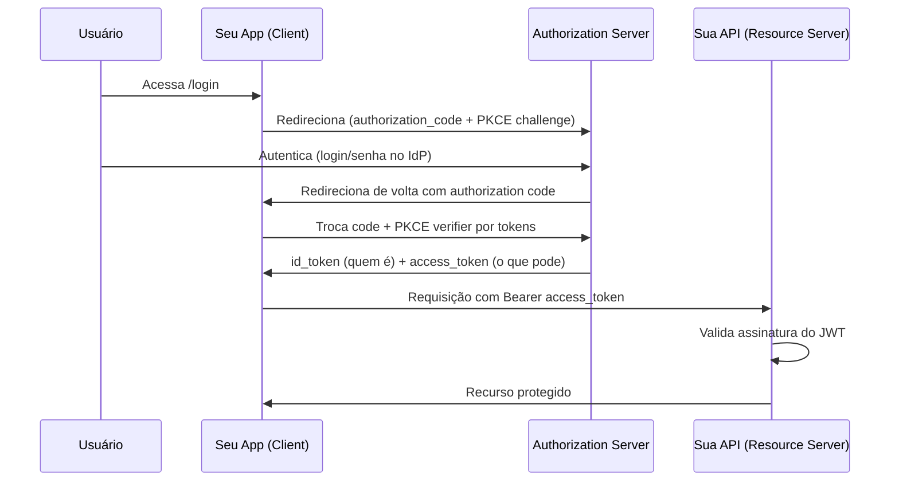

# Login e Cadastro modernos em Java com OAuth 2.0 / OpenID Connect

> Como implementar autenticação e cadastro de usuários da forma recomendada em 2026: **Spring Boot 4.1 + Spring Security 7**, usando OAuth 2.0 + OpenID Connect com o fluxo *Authorization Code + PKCE*.

A primeira lição deste guia é conceitual e economiza muita dor de cabeça: **você não deveria mais armazenar e validar senhas você mesmo se puder evitar.** A abordagem moderna delega a autenticação a um provedor de identidade (IdP) confiável — seja um terceiro (Google, GitHub, Microsoft) ou um servidor de identidade que você hospeda (Keycloak). Seu sistema deixa de guardar senhas e passa a confiar em *tokens* assinados.

---

## Índice

- [OAuth 2.0 ≠ OpenID Connect (a distinção que todo mundo confunde)](#oauth-20--openid-connect)
- [Os quatro papéis do OAuth](#os-quatro-papéis-do-oauth)
- [Qual fluxo usar em 2026](#qual-fluxo-usar-em-2026)
- [Versões e dependências](#versões-e-dependências)
- [Cenário A — Login social (delegar a Google/GitHub)](#cenário-a--login-social)
- [Cadastro: provisionar o usuário no primeiro login](#cadastro-provisionar-o-usuário-no-primeiro-login)
- [Cenário B — IdP próprio com Keycloak (controle total de login e cadastro)](#cenário-b--idp-próprio-com-keycloak)
- [Protegendo a API (Resource Server com JWT)](#protegendo-a-api-resource-server-com-jwt)
- [Checklist de segurança](#checklist-de-segurança)
- [Quando ainda faz sentido login com senha próprio](#quando-ainda-faz-sentido-login-com-senha-próprio)
- [Referências](#referências)

---

## OAuth 2.0 ≠ OpenID Connect

Essa confusão é a raiz de metade dos erros de implementação:

- **OAuth 2.0** é um protocolo de **autorização** — responde "este app *pode* acessar tal recurso em nome do usuário?". Ele foi feito para delegar acesso, não para provar *quem* é o usuário.
- **OpenID Connect (OIDC)** é uma camada *fina* construída **em cima** do OAuth 2.0 que adiciona **autenticação** — responde "*quem* é o usuário?". Ele introduz o `id_token` (um JWT com os dados de identidade do usuário).

> Regra prática: para **login** (saber quem é a pessoa), você quer **OIDC**. Para **acessar APIs de terceiros** em nome dela, você quer **OAuth 2.0**. Na prática, ambos andam juntos, e o Spring trata os dois com o mesmo starter.

---

## Os quatro papéis do OAuth

Entender quem é quem evita 90% da confusão de configuração:

| Papel | O que é | Exemplo |
|---|---|---|
| **Resource Owner** | O usuário, dono dos dados | A pessoa logando |
| **Client** | A aplicação que quer acesso | Seu app Spring Boot |
| **Authorization Server** | Quem autentica e emite tokens | Google, Keycloak |
| **Resource Server** | A API que guarda os recursos protegidos | Sua API REST |

No Spring, o mesmo app costuma ser ao mesmo tempo **Client** (faz o login do usuário) e **Resource Server** (protege seus próprios endpoints). São dois starters diferentes para esses dois papéis.

---

## Qual fluxo usar em 2026

O fluxo recomendado hoje é **Authorization Code com PKCE** (*Proof Key for Code Exchange*). Os outros fluxos antigos estão obsoletos:

- ❌ **Implicit Grant** — descontinuado. Expunha o token na URL.
- ❌ **Resource Owner Password Credentials (ROPC)** — descontinuado. O app via a senha do usuário, o que mata o propósito do OAuth.
- ✅ **Authorization Code + PKCE** — o padrão para apps web e mobile. O `PKCE` protege contra interceptação do *authorization code*, e hoje é recomendado para **todos** os clients, não só os públicos.
- ✅ **Client Credentials** — para comunicação máquina-a-máquina (serviço chamando serviço, sem usuário).

O Spring Security 7 já aplica PKCE automaticamente no fluxo de Authorization Code. Você não precisa configurar nada à mão para isso.



---

## Versões e dependências

Stack-alvo (junho de 2026):

| Componente | Versão |
|---|---|
| Spring Boot | 4.1.x |
| Spring Framework | 7.0.x |
| Spring Security | 7.0.x |
| Java | 17+ (recomendado 21 LTS ou 25) |

> ⚠️ Atenção à migração: o Spring Boot 3.5 chega ao fim do suporte open-source em **30/06/2026**. Para projetos novos, comece direto no 4.x. A geração 4 roda sobre Spring Framework 7, migra para Jackson 3 e adota o JSpecify para anotações de nulidade.

### `pom.xml`

```xml
<parent>
    <groupId>org.springframework.boot</groupId>
    <artifactId>spring-boot-starter-parent</artifactId>
    <version>4.1.0</version>
</parent>

<dependencies>
    <!-- Web -->
    <dependency>
        <groupId>org.springframework.boot</groupId>
        <artifactId>spring-boot-starter-web</artifactId>
    </dependency>

    <!-- Fundação de segurança -->
    <dependency>
        <groupId>org.springframework.boot</groupId>
        <artifactId>spring-boot-starter-security</artifactId>
    </dependency>

    <!-- OAuth2 Client: faz o LOGIN (OAuth2/OIDC) -->
    <dependency>
        <groupId>org.springframework.boot</groupId>
        <artifactId>spring-boot-starter-oauth2-client</artifactId>
    </dependency>

    <!-- OAuth2 Resource Server: protege a API com JWT -->
    <dependency>
        <groupId>org.springframework.boot</groupId>
        <artifactId>spring-boot-starter-oauth2-resource-server</artifactId>
    </dependency>

    <!-- Persistência do usuário provisionado -->
    <dependency>
        <groupId>org.springframework.boot</groupId>
        <artifactId>spring-boot-starter-data-jpa</artifactId>
    </dependency>
</dependencies>
```

---

## Cenário A — Login social

Delegar o login a Google/GitHub é o caminho mais rápido e mais seguro para a maioria das aplicações. Você não guarda senha nenhuma.

### 1. Registre o app no provedor

No Google Cloud Console (ou GitHub Developer Settings), crie credenciais OAuth e configure a **redirect URI**:

```
http://localhost:8080/login/oauth2/code/google
```

Esse caminho `/login/oauth2/code/{registrationId}` é o padrão que o Spring Security espera por convenção.

### 2. `application.yml`

```yaml
spring:
  security:
    oauth2:
      client:
        registration:
          google:
            client-id: ${GOOGLE_CLIENT_ID}
            client-secret: ${GOOGLE_CLIENT_SECRET}
            scope:
              - openid      # <- pede OIDC (autenticação)
              - profile
              - email
          github:
            client-id: ${GITHUB_CLIENT_ID}
            client-secret: ${GITHUB_CLIENT_SECRET}
            scope:
              - read:user
              - user:email
```

> 🔐 **Nunca** versione `client-secret` no Git. Use variáveis de ambiente (`${...}`) ou um cofre de segredos. Adicione `application-secrets.yml` ao `.gitignore`.

### 3. `SecurityConfig` (DSL lambda do Spring Security 7)

```java
package com.exemplo.config;

import org.springframework.context.annotation.Bean;
import org.springframework.context.annotation.Configuration;
import org.springframework.security.config.annotation.web.builders.HttpSecurity;
import org.springframework.security.web.SecurityFilterChain;

@Configuration
public class SecurityConfig {

    @Bean
    SecurityFilterChain filterChain(HttpSecurity http,
                                    CustomOidcUserService oidcUserService) throws Exception {
        http
            .authorizeHttpRequests(auth -> auth
                .requestMatchers("/", "/login**", "/css/**").permitAll()
                .anyRequest().authenticated()
            )
            .oauth2Login(oauth -> oauth
                // serviço que provisiona/atualiza o usuário no nosso banco
                .userInfoEndpoint(userInfo -> userInfo
                    .oidcUserService(oidcUserService)
                )
                .defaultSuccessUrl("/dashboard", true)
            )
            .logout(logout -> logout
                .logoutSuccessUrl("/")
            );
        return http.build();
    }
}
```

Note a sintaxe: no Spring Security 6.1+ e obrigatoriamente no 7, **toda configuração usa lambdas**. O antigo encadeamento com `.and()` e a `WebSecurityConfigurerAdapter` foram removidos.

---

## Cadastro: provisionar o usuário no primeiro login

Esta é a parte que une **login** e **cadastro**. No modelo OAuth/OIDC, o "cadastro" deixa de ser um formulário de senha e vira **provisionamento**: na primeira vez que alguém loga via provedor, você cria o registro local; nas próximas, apenas atualiza. É o padrão *Just-In-Time (JIT) provisioning*.

### Entidade local do usuário

Repare: **sem campo de senha**. A senha vive no IdP, nunca no seu banco.

```java
@Entity
@Table(name = "usuario")
@Getter @Setter
@NoArgsConstructor @AllArgsConstructor @Builder
public class Usuario {

    @Id @GeneratedValue(strategy = GenerationType.IDENTITY)
    private Long id;

    @Column(nullable = false, unique = true)
    private String email;

    private String nome;
    private String fotoUrl;

    @Column(nullable = false)
    private String provedor;        // "google", "github"...

    @Column(nullable = false)
    private String provedorId;      // o "sub" do token (id estável do usuário no IdP)

    @Enumerated(EnumType.STRING)
    private Role role;

    @CreationTimestamp
    private Instant criadoEm;

    @UpdateTimestamp
    private Instant atualizadoEm;
}
```

### Serviço de provisionamento

O `OidcUserService` é o ponto de extensão: o Spring chama esse serviço após validar o token, e é aqui que você sincroniza o usuário com o banco.

```java
@Service
@RequiredArgsConstructor
public class CustomOidcUserService extends OidcUserService {

    private final UsuarioRepository repository;

    @Override
    public OidcUser loadUser(OidcUserRequest userRequest) {
        // 1. Deixa o Spring buscar e validar os dados do IdP
        OidcUser oidcUser = super.loadUser(userRequest);

        String provedor = userRequest.getClientRegistration().getRegistrationId();
        String email = oidcUser.getEmail();
        String sub = oidcUser.getSubject(); // id estável do usuário no provedor

        // 2. Provisionamento JIT: cria no primeiro login, atualiza nos seguintes
        repository.findByEmail(email)
            .map(u -> atualizar(u, oidcUser))
            .orElseGet(() -> cadastrar(provedor, sub, oidcUser));

        // 3. Devolve o principal (pode ser enriquecido com authorities locais)
        return oidcUser;
    }

    private Usuario cadastrar(String provedor, String sub, OidcUser oidcUser) {
        Usuario novo = Usuario.builder()
            .email(oidcUser.getEmail())
            .nome(oidcUser.getFullName())
            .fotoUrl(oidcUser.getPicture())
            .provedor(provedor)
            .provedorId(sub)
            .role(Role.USER)
            .build();
        return repository.save(novo); // <- aqui acontece o "cadastro"
    }

    private Usuario atualizar(Usuario existente, OidcUser oidcUser) {
        existente.setNome(oidcUser.getFullName());
        existente.setFotoUrl(oidcUser.getPicture());
        return repository.save(existente);
    }
}
```

> 💡 Use o `sub` (subject) como identificador estável, **não** o e-mail — alguns provedores permitem trocar o e-mail. O `sub` é imutável dentro de um provedor.

---

## Cenário B — IdP próprio com Keycloak

Quando você precisa de **controle total** sobre login, cadastro, recuperação de senha, MFA e telas customizadas — mas ainda sem implementar criptografia de senha você mesmo — a recomendação é hospedar um **Authorization Server** dedicado. O **Keycloak** (open-source, maduro) é o padrão de mercado.

Vantagens sobre o login social puro: você controla as telas, tem cadastro próprio, MFA, federação com vários provedores e gestão de papéis num só lugar. A abordagem moderna usa o suporte nativo de Resource Server do Spring Security; é mais simples, mais sustentável e segue a arquitetura atual do Spring, sem dependências específicas do Keycloak.

### `application.yml` (Client apontando para o Keycloak)

```yaml
spring:
  security:
    oauth2:
      client:
        registration:
          keycloak:
            client-id: meu-app
            client-secret: ${KEYCLOAK_SECRET}
            authorization-grant-type: authorization_code
            scope: openid, profile, email
        provider:
          keycloak:
            issuer-uri: https://auth.meudominio.com/realms/meu-realm
```

O `issuer-uri` é a mágica do OIDC: o Spring faz *discovery* automático lendo `/.well-known/openid-configuration` e descobre sozinho todos os endpoints (autorização, token, JWKS para validar assinaturas).

> Não confunda os papéis: o **Keycloak** é o Authorization Server. Seu app Spring continua sendo só o **Client** + **Resource Server**. Você não implementa o servidor de autorização — usa um pronto e testado.

---

## Protegendo a API (Resource Server com JWT)

Para uma API REST stateless (consumida por SPA React, mobile etc.), o app valida o `access_token` (JWT) a cada requisição. Para proteger uma API com JWTs, tudo o que se precisa é um bean JwtDecoder, usado para validar assinaturas e decodificar os tokens; o Spring Security usa esse bean automaticamente para configurar a proteção no SecurityFilterChain.

### `application.yml`

```yaml
spring:
  security:
    oauth2:
      resourceserver:
        jwt:
          issuer-uri: https://auth.meudominio.com/realms/meu-realm
```

Só com isso o Spring valida assinatura, expiração e emissor. Sem código.

### Config do Resource Server

```java
@Configuration
@EnableMethodSecurity   // habilita @PreAuthorize nos métodos
public class ResourceServerConfig {

    @Bean
    SecurityFilterChain apiFilterChain(HttpSecurity http) throws Exception {
        http
            .securityMatcher("/api/**")
            .authorizeHttpRequests(auth -> auth
                .requestMatchers("/api/public/**").permitAll()
                .anyRequest().authenticated()
            )
            .oauth2ResourceServer(oauth -> oauth.jwt(jwt -> {}))
            // API stateless: sem sessão, sem CSRF de formulário
            .sessionManagement(s -> s.sessionCreationPolicy(SessionCreationPolicy.STATELESS))
            .csrf(csrf -> csrf.disable());
        return http.build();
    }
}
```

```java
@RestController
@RequestMapping("/api")
public class MedicamentoController {

    @GetMapping("/medicamentos")
    @PreAuthorize("hasRole('USER')")
    public List<MedicamentoDTO> listar(@AuthenticationPrincipal Jwt jwt) {
        String email = jwt.getClaimAsString("email"); // dados direto do token
        return service.listarDoUsuario(email);
    }
}
```

---

## Checklist de segurança

- ✅ Use **HTTPS** sempre, inclusive em homologação. Tokens em texto claro = tokens comprometidos.
- ✅ Não guarde senhas. Se o cenário exigir, use **OIDC/OAuth** delegado.
- ✅ Mantenha `client-secret` fora do Git (variáveis de ambiente / cofre).
- ✅ Valide sempre `issuer` e `audience` do JWT (o Spring faz por padrão com `issuer-uri`).
- ✅ Para APIs stateless, desabilite CSRF e use `SessionCreationPolicy.STATELESS`. Para apps web com sessão, **mantenha** o CSRF habilitado.
- ✅ Prefira **access tokens curtos** + **refresh tokens** com rotação.
- ✅ Em SPA, evite guardar tokens em `localStorage` (vulnerável a XSS); prefira cookies `HttpOnly`/`Secure` via padrão *Backend for Frontend (BFF)*.
- ✅ O **PKCE** já vem aplicado pelo Spring Security 7 no fluxo de Authorization Code.

---

## Quando ainda faz sentido login com senha próprio

Honestamente, nem todo projeto precisa de OAuth. Login local com senha ainda é válido quando:

- É uma aplicação interna sem necessidade de integração com identidades externas.
- Há restrição regulatória que exige todos os dados de auth on-premise sem um IdP.
- É um projeto de estudo cujo objetivo *é* aprender hashing de senha.

Se for esse o caso, a regra inquebrável: **nunca armazene senha em texto claro**. Use `BCryptPasswordEncoder` (ou Argon2) do Spring Security, e não invente seu próprio esquema de criptografia. Mas mesmo aqui, em 2026, a tendência clara é delegar autenticação para reduzir superfície de ataque e responsabilidade sobre dados sensíveis.

---

## Referências

1. **Spring Security — OAuth 2.0** — documentação oficial: https://docs.spring.io/spring-security/reference/servlet/oauth2/index.html
2. **OpenID Connect Core** — especificação: https://openid.net/specs/openid-connect-core-1_0.html
3. **RFC 7636 (PKCE)** — https://datatracker.ietf.org/doc/html/rfc7636
4. **Keycloak — Securing Applications** — https://www.keycloak.org/docs/latest/securing_apps/
5. **Spring Boot 4 / Spring Framework 7 — novidades** — Baeldung e InfoQ têm bons panoramas da migração.

> Nota final para o catálogo: este guia cobre o "feliz caminho". Em produção, dedique atenção a *logout federado* (encerrar a sessão no IdP também), *rotação de refresh token* e *tratamento de erro de redirect*. Esses três são onde a maioria dos bugs de integração aparece.
